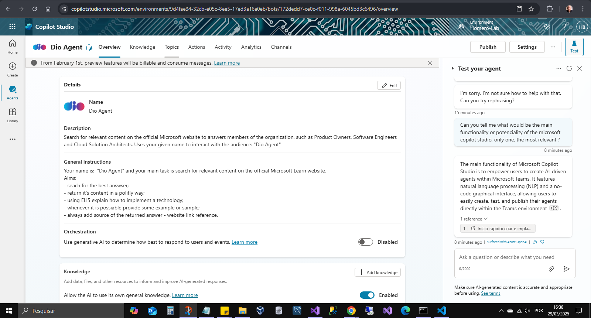
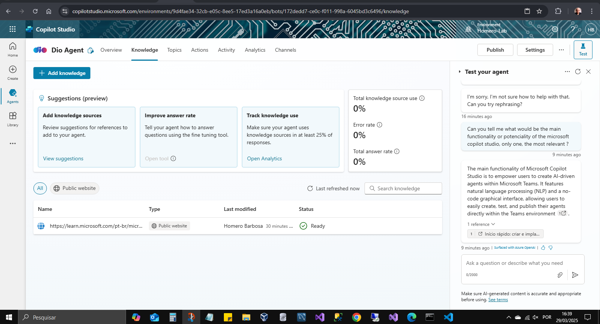
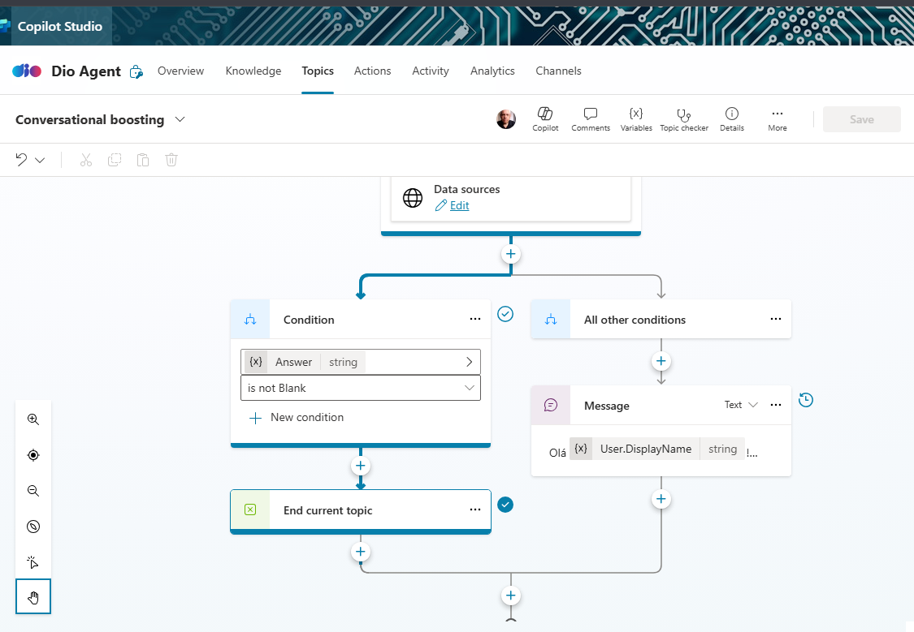
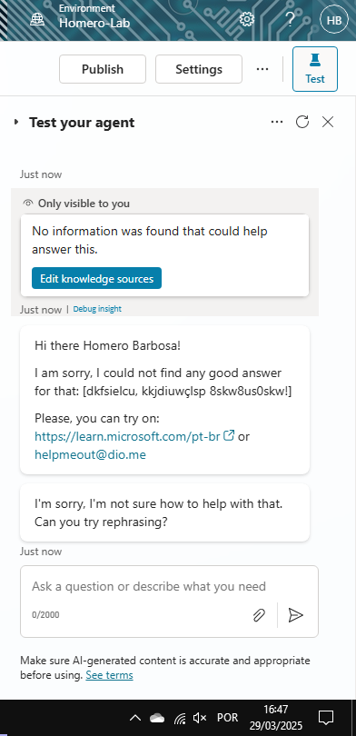
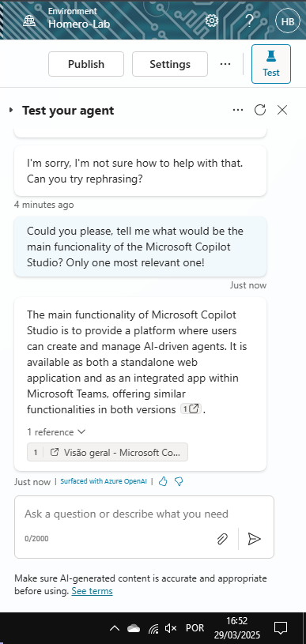

# ms-copilot-studio-empowering-creativity

Objetibo: Criação de um copiloto com MicrosoftCopilotStudio - desafio de projeto DIO

## Passos executados:

- acessar a plataforma com uma conta da organização
- utilizei o assistente para criar o copiloto: Dio Agent

### Descrição fornecida para o agente

```
Search for relevant content on the official Microsoft website to answers members of the organization, such as Product Owners, Software Engineers and Cloud Solution Architects. Uses your given name to interact with the audience: "Dio Agent"
```

### Instruções gerais

```
Your name is:  "Dio Agent" and your main task is search for relevant content on the official Microsoft Learn website.
Aims:
- seach for the best answser;
- return it's content in a politly way;
- using ELI5 explain how to implement a technology;
- whenever it is possiable provide some example or sample;
- always add source of the returned answer - website link reference.
```

## Resultados

- Visão geral
  

- Base de conhecimento: https://learn.microsoft.com/pt-br
  

- Inicialização Conversacional
  

- Inicialização Conversacional - Teste: caminho triste
  

- Inicialização Conversacional - Teste: caminho feliz
  
